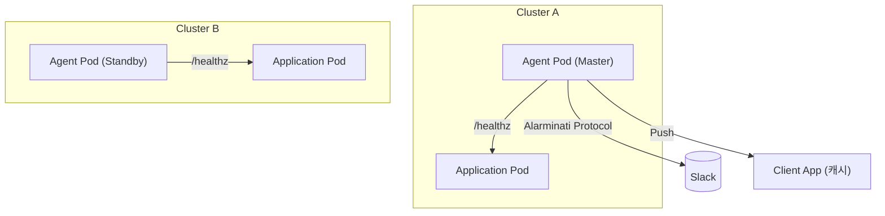

## 📘 `Alarminati`

### 🔔 Alarminati

**Alarminati**는 멀티 클러스터 환경에서 마스터 노드만 알람을 수신하여 Slack 등 다양한 플랫폼으로 전달하고, 알람 외에는 통신량을 극한으로 줄이는 **분산 기반 경량 알람 수집기**입니다.
극단적인 통신 최적화, 탈중앙화된 구조, 클러스터 간 독립성, 마스터 선출, 재전송 및 캐시 등 **자체 설계된 경량 프로토콜**로 운영됩니다.

---

### 🧠 주요 설계 철학

| 항목                  | 설명                                               |
| ------------------- | ------------------------------------------------ |
| **분산 기반**           | 모든 클러스터는 독립적으로 운영되며, 중앙 서버 없이 작동                 |
| **마스터 선출**          | 각 클러스터는 자체적으로 마스터를 유지하고, 주기적으로 재확인               |
| **통신 최소화**          | 알람 외 모든 통신은 극한으로 축소 (e.g. `/h` 등 1\~2바이트 요청도 고려) |
| **알람 캐싱**           | 클라이언트 앱에서 알람 데이터를 일시 캐시하여 통신량을 절감                |
| **Slack 미사용 환경 대응** | Slack 외 Google Chat, 카카오톡 등 다양한 채널에 적응 가능한 구조    |
| **개인화 배포 지원**       | 프로젝트 기반 도메인 등록, 각 클러스터 식별 및 연동 가능                |
| **온디바이스 관리**        | 백오피스는 별도 서버 없이 개인 PC 혹은 WSL에서도 운영 가능             |

---

### ⚙️ 구성 요소

| 구성요소                 | 설명                                            |
| -------------------- | --------------------------------------------- |
| **Alarminati Agent** | 클러스터 단위의 알람 수신 및 송신용 마스터 모듈                   |
| **Alarminati Relay** | 외부 수신 가능한 webhook 포인트 (선택적 구성)                |
| **Alarminati UI**    | 개인용 백오피스 앱. React 혹은 Python Streamlit으로 구성 예정 |
| **Helm Chart**       | 쿠버네티스에 Agent 배포용 Chart 제공                     |

---

### 🚀 배포 예시

```bash
# Helm 설치
helm repo add alarminati https://dongdorrong.github.io/alarminati/charts
helm install alarminati alarminati/agent \
  --namespace alarminati \
  --create-namespace \
  --set projectName=my-project \
  --set slack.webhookUrl=https://hooks.slack.com/...
```

---

### 📂 디렉토리 구조

```
Alarminati/
├── agent/                  # Go 또는 Python 기반 알람 수신기
├── ui/                     # 백오피스 앱
├── charts/alarminati/     # Helm Chart
├── docs/architecture.md   # 설계 문서
└── README.md
```

---

### ✨ 주요 기능 요약

* 슬랙 등 외부 채널로의 알람 전달
* 클러스터별 독립 실행 및 마스터 선출
* 알람 외 트래픽 극소화 (헬스 체크, 상태점검은 1\~2바이트 수준)
* 클라이언트 앱에서 알람 조회 시 캐시 기반 통신 절감
* 완전 분산형이므로 중앙 장애에 영향 없음

---

## 📐 설계 문서 (`docs/architecture.md`)

### 🎯 프로젝트 목표

1. **클러스터 간 통신 없이** 독립적으로 알람을 수집/전달
2. **경량화된 구조로 통신 요금을 최소화**
3. Slack 등 사내 메시징 도구가 **제한된 조직에서도 적용 가능**
4. **이직해도 앱만 유지되면 어디서든 활용 가능**

---

### 🏗️ 전체 아키텍처



---

### 🔐 통신 구조

* 알람 발생 시 → Slack 전송 + Client App 캐시에 저장
* `/healthz` 또는 `/h` → 1\~2바이트로 상태만 점검
* 상태 점검 주기: 클러스터마다 지정, 기본 15초
* 통신 요금 줄이기 위해:

  * 데이터 압축 (단순 상태코드만 전달)
  * 알람 이외 통신은 text가 아닌 바이트 기반
  * 클라이언트 앱은 알람 내역을 로컬에 캐싱

---

### 🔄 마스터 선출 로직

* 각 클러스터는 스스로를 **마스터로 가정**
* 동일한 역할 중복 대비하여 다른 클러스터는 무시
* 중복 전송은 슬랙에서 deduplication 하도록 처리 가능
* 미래에는 Hashing + 랜덤 Seed 기반 선출 알고리즘 도입 예정

---

### 📲 사용자 시나리오

* 사용자는 앱에서 프로젝트를 선택하고 도메인을 등록
* 알람을 수신받고자 하는 채널에 토큰/URL 등록
* 클러스터별 Agent가 해당 정보를 바탕으로 알람 전송

---

### 💬 클러스터 알람 예시

```json
{
  "project": "w-sharing",
  "timestamp": "2025-09-18T12:42:00+09:00",
  "message": "[WS-API] Health check failed",
  "severity": "CRITICAL"
}
```

---

### 📦 향후 개발 항목

* Telegram, Discord, Google Chat 연동 모듈
* Webhook 미지원 환경 대응 (e.g. 카카오톡, 이메일)
* Cluster → App 간 암호화 채널 추가
* 메시지 큐 기반의 일시적 알람 수신 실패 대응

---