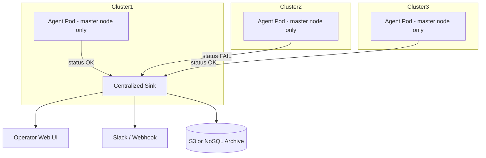

---

# Alarminati - Distributed Alert Propagation Framework

## 🔍 Overview

**Alarminati**는 멀티 클러스터 Kubernetes 환경에서 **극도로 경량화된 분산형 알람 전파 시스템**입니다.
모든 클러스터는 **독립적으로 상태를 판단**하고, **마스터 노드에서만 agent가 작동**합니다.
Slack, Webhook, Telegram 등 다양한 방식으로 알람을 전송할 수 있으며, **데이터 전송은 알람 메시지 이외에는 거의 발생하지 않습니다.**

이 프로젝트는 다양한 조직(특히 SI, 중견기업)의 비일관된 알람 인프라 상황을 고려하여 설계되었습니다.

---

## 🧱 Architecture

### 구성 요소

| 디렉토리                 | 설명                                              |
| -------------------- | ----------------------------------------------- |
| `agent/`             | 각 클러스터의 마스터 노드에 배포되는 Go 기반 경량 Agent             |
| `ui/`                | 관리자 로컬 PC에서 실행되는 Web UI (도메인-알람 매핑, 로그 통합 조회 등) |
| `charts/alarminati/` | Helm Chart 디렉토리                                 |
| `docs/`              | 아키텍처, 통신 프로토콜, 운영 가이드 문서 포함                     |

### 통신 흐름

```mermaid
graph TD
  subgraph ClusterA["Cluster A"]
    AgentA["Agent (Master Node)"]
  end

  subgraph ClusterB["Cluster B"]
    AgentB["Agent (Master Node)"]
  end

  subgraph External["Slack 등 외부"]
    Sink["Slack &#124; Discord &#124; Webhook Receiver"]
  end

  AgentA -->|Health Check| AgentB
  AgentB -->|Health Check| AgentA
  AgentA -->|Alarm Message| Sink
  AgentB -->|Alarm Message| Sink
```

---

## 🎯 Design Goals

### 경량화 중심 설계

* `/healthz` 경로를 통한 단방향 상태 확인만 수행
* 알람 메시지 외에는 통신 없음 (no heartbeat, no polling)
* 알람 메시지는 gzip 압축 + 구조체 minimalization으로 수 KB 수준 유지

### 데이터 저장 전략

* 알람 메시지는 로그 형태로 S3 또는 Object Storage에 저장
* RDBMS 사용 없음 → 비용 절감 및 유지보수 간소화
* UI 또는 CLI로 on-demand 시간순 정렬/조회 가능

### 보안

* 모든 알람 메시지에 토큰 또는 서명 포함
* 클러스터 간 접근은 IP allowlist 기반, 필요시 mTLS 도입 고려

---

## 🚀 Features

* 마스터 노드 전용 알람 감지 Agent
* 도메인 기반 프로젝트 알람 매핑
* Slack, Telegram, Webhook 지원
* 불필요한 중복 알람 방지 (클러스터 간 상태 공유)
* 클러스터 간 통신 최소화 (데이터 사용량 절감)
* 메시지 전송 실패 대비 이중화 처리 및 로컬 재시도 로직 탑재

---

## 🧪 Use Case

* 팀마다 알람 채널(Slack/카톡/구글챗 등)이 달라 **단일 알람 시스템 구성 불가**한 조직
* 중앙 알람 시스템 없이 **클러스터 간 분산형 알람 전파**가 필요한 환경
* 기존 SI 환경처럼 **권한 부족/알람 구성 통제 불가**한 경우

---

## 📦 Deployment Structure

---

## 🔧 Local Dev Guide

* `agent/`: Go 기반, `CGO_ENABLED=0`로 cross-compile 가능
* `charts/alarminati/`: Helm 3 compatible, namespace-per-cluster 설치 권장
* `ui/`: Svelte 또는 React 기반 lightweight UI (관리자 PC에서 실행)

---

## 📌 Roadmap

* [ ] UI 프로젝트별 도메인 관리 기능 구현
* [ ] Slack 메시지 알림 UI 연동
* [ ] CLI 도구로 알람 수신 테스트, 시뮬레이터 구현
* [ ] OTP 혹은 단순 토큰 인증 포함하여 클러스터 식별 강화
* [ ] 알람 메시지 schema 버전 관리 (예: `v1alpha1` → `v1`)

---

## ✍️ Contribution

* Fork & PR 환영합니다
* 제안, 피드백은 [Issues](https://github.com/dongdorrong/Alarminati/issues)로 주세요

---